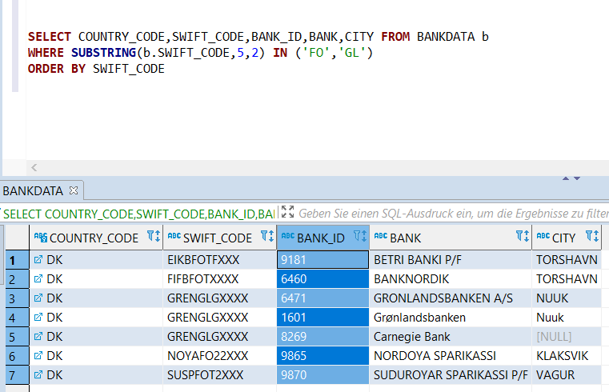

# Bankendaten

Eine Sammulung von Daten über Banken

Seit der Einführung der [S€PA](https://de.wikipedia.org/wiki/Europ%C3%A4ischer_Zahlungsraum#Teilnehmerl%C3%A4nder) und der [IBAN-Pflicht](https://de.wikipedia.org/wiki/Internationale_Bankkontonummer#IBAN-Pflicht) wissen wir nicht mehr genau, wohin wir Geld überweisen. Ja, aus der IBAN `MC58 1166 8400 0112 3456 7890 191` können wir herauslesen, dass unser Geschäftspartner ein Konto in Monaco hat. 

- aber welche Bank ist es? es gibt viele Banken in Monaco.
- mit etwas google'n erfahren wir den `"bank_code":11668` und `"branch_code":40001`. Mehr nicht.
- wie erfährt man aus der IBAN die [BIC](https://de.wikipedia.org/wiki/ISO_9362), die uns dann zur Bank, der Adresse oder den Kontaktdaten führen könnte?

Das Beispiel stammt aus [iban.com-API](https://github.com/klst-de/iban.com-API/blob/master/README.md), wo auch die Auflösung steht.

Pro IBAN-Land wird hier die Sammlung aufgebaut. Später kommen die nicht IBAN-Länder hinzu. Die Daten dazu kann man in Projekten wie [swiftcode](https://github.com/Thomanphan/swiftcode) finden. 

Die [iban registry](https://www.iso13616.org/) (Release 87 – May 2020) listet 77 Länder. Etwa die Hälfte sind bereits in der Sammlung.

### IBAN-BIC Anomalien

Die Länderkennung gibt es nicht nur in der IBAN, sondern auch im [SWIFT-BIC](https://de.wikipedia.org/wiki/ISO_9362). Dabei kommt es zu [Anomalien](https://de.wikipedia.org/wiki/ISO_9362#Unzul%C3%A4nglichkeiten), die sich in der Sammlung wiederspiegeln.

Beispiele:

Laut iban registry gibt es IBANs die mit `FO` bzw. `GL` beginnen. Da sich die Clearingstelle für Grönland (GL) in Dänemark (DK) befindet, findet man die GL Banken in der Dänemark-Sammlung. Gleiches gilt für FO – Faroe Islands.

 